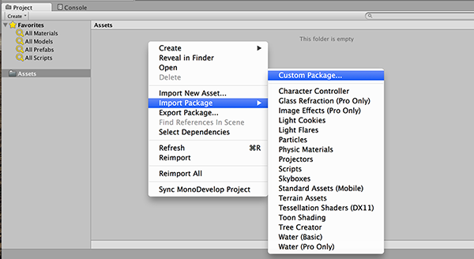
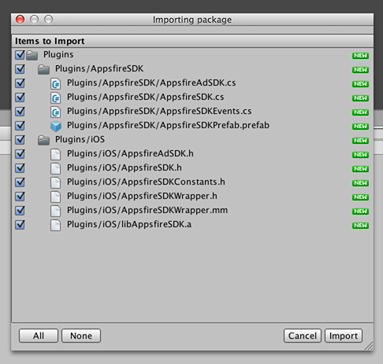
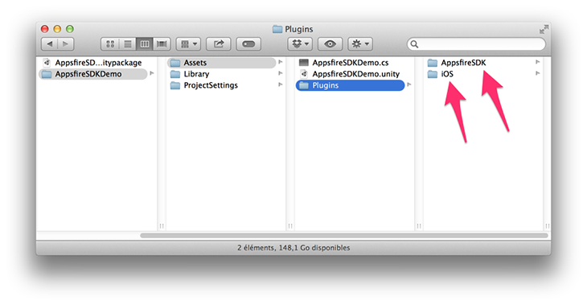
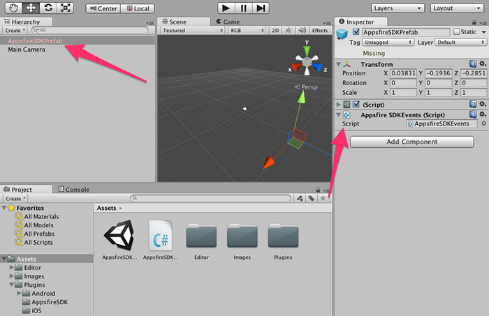

# I] Introduction
The plugin of Appsfire SDK currently works only for iOS. However its integration shouldn't affect the build on any other platform.

This documentation is a brief introduction to Appsfire SDK for Unity. We recommend you to take a look on the general documentation that you can find in your dashboard. Most of methods were implemented in Unity. If you have a problem during the integration, don't hesitate to contact our product designer called Jonathan at <a href="mailto:jonathan@appsfire.com">jonathan@appsfire.com</a>.

We recommend you to read the integration reference documentation that you find at this url <a href="http://docs.appsfire.com/" target="_blank">http://docs.appsfire.com/</a>.

# II] Installation

First you need to add Appsfire SDK files into your Unity project. For this you have two possibilities.

## Case 1: Import the Unity Package
Appsfire provides you a package named **"AppsfireSDK.unitypackage"** that you can import from Unity. Just do a right-click on the "project" part, select "Import Package" / "Custom Package", and choose the AppsfireSDK.unitypackage file.

Once you selected the package, you'll have to verify the imported files. You don't have to unbox 
something, you can directly click on "Import".

  
## Case 2: Copy each file manually

Otherwise, you can directly copy paste the files from /AppsfireSDKDemo/Assets/Plugins.

  
# III] Implementation
There are 5 important files that you need to be aware of:

* **AppsfireSDKPrefab.prefab** : prefab to include in your project. It'll be used for the communication between our library and Unity.
* **AppsfireSDK.cs** : the "base" library (e.g. initialize the library).
* **AppsfireEngageSDK.cs** : the "engage" library (e.g. displaying notifications view, handling push system, ...).
* **AppsfireAdSDK.cs** : the "monetization" library (e.g. displaying ads to do money).
* **AppsfireSDKEvents.cs** : subscribing and receiving any event related the "engage" and "monetization" library.

For the following example, <u>we recommend you to take a look at AppsfireSDKDemo.cs</u> file which is in the demo project included in the zip (with the unitypackage).

## Step 1: Include the prefab

Some actions are required to correctly initialize AppsfireSDK and get events.
**So please make sure that:**

* The prefab `AppsfireSDKPrefab.prefab` is included in your project.
* The script `AppsfireSDKEvents.cs` is added to your prefab

## Step 2: Specify the API key
In your **Start()** method, you need to add a required initialization method where you put your **API KEY**. If you don't have it yet, please check the general documentation which explains how to get it thanks to your dashboard.

As second parameter, you should precise what features you want to enable. For exaemple, if you plan to only use monetization SDK (to display ads), then you should put `AFSDKFeature.AFSDKFeatureMonetization`.

	// af sdk - connect with your api key
	AppsfireSDK.ConnectWithAPIKey("YOUR API KEY", AFSDKFeature.AFSDKFeatureMonetization);
	
## Step 3: Display the notifications wall
To display the notifications wall, you just have to call the following method.

	AppsfireEngageSDK.PresentPanelForContentAndStyle(AFSDKPanelContent.AFSDKPanelContentDefault, AFSDKPanelStyle.AFSDKPanelStyleFullscreen);

You can customize the experience by specifying custom colors. <u>But it's best to add the following lines in the Start() method!!!</u>

	AF_RGBA backgroundColor, textColor;
	
	// af sdk - customize background and text colors
	// these values are default colors, you can customize with the colors of your app
	backgroundColor = new AF_RGBA(66.0/255.0, 67.0/255.0, 69.0/255.0, 1.0);
	textColor = new AF_RGBA(1.0, 1.0, 1.0, 1.0);
	AppsfireEngageSDK.SetBackgroundAndTextColor(backgroundColor, textColor);
	
## Step 4: Display Ads
It's easy to display ads during breakout sessions.
	
When you are ready to display an ad, you just have to check if any is available, and then request it!

	if (AppsfireAdSDK.IsThereAModalAdAvailable())
		AppsfireAdSDK.RequestModalAd(AFAdSDKModalType.AFAdSDKModalTypeSushi);

You can be alerted that an ad is available thanks to an event. So you can directly display the ad! or wait a breakout session to display it.

	void OnEnable()
	{
		AppsfireSDKEvents.afsdkadModalAdsRefreshedAndAvailable += this.afsdkadModalAdsRefreshedAndAvailable;
	}
	
	void OnDisable()
	{
		AppsfireSDKEvents.afsdkadModalAdsRefreshedAndAvailable -= this.afsdkadModalAdsRefreshedAndAvailable;
	}
	
	public void afsdkadModalAdsRefreshedAndAvailable()
	{
		Debug.Log("Appsfire Ad SDK - Modal Ad Refreshed And Available For Request");
		if (AppsfireAdSDK.IsThereAModalAdAvailable(AFAdSDKModalType.AFAdSDKModalTypeUraMaki) == AFAdSDKAdAvailability.AFAdSDKAdAvailabilityYes) {
			AppsfireAdSDK.RequestModalAd(AFAdSDKModalType.AFAdSDKModalTypeSushi);
		}
	}

## Step 5: Register to events
You can easily register and get events from any place of your code.

Here is an example if you want to know when the badge counter is updated.

	void OnEnable()
	{
		AppsfireSDKEvents.afsdkNotificationsNumberChanged += this.afsdkNotificationsNumberChanged;
	}
	
	void OnDisable()
	{
		AppsfireSDKEvents.afsdkNotificationsNumberChanged -= this.afsdkNotificationsNumberChanged;
	}
	
	// notifications count was updated
	public void afsdkNotificationsNumberChanged()
	{
		Debug.Log("Appsfire SDK - Number of Notifications was updated");
		int numberOfNotifications = AppsfireSDK.NumberOfPendingNotifications();
	}
	
If you don't get any event, it's likely that the prefab isn't used in your project.

# IV] Xcode and frameworks

We're using the projet `XUPorter` to automatically add some frameworks to your Xcode project. If you're building the demo project, it should directly work! (you can find the plugin in /Assets/Editor/XUPorter).

When you're implementing the sdk into your project, you can either use XUPorter, or manually add the following frameworks after the build that creates the Xcode projet:
* Accelerate
* AdSupport
* Security
* StoreKit